# Bug Report — HW02 Domain Testing on EShop

**Họ và tên:** [Phạm Vũ Ngọc Duy] · **MSSV:** [23127183] · **Nhóm:** [10]
**Repo GitHub Issues (chứa screenshot):** https://github.com/DuyPham111/HW02/issues
**Môi trường chung:** Windows 11, Chrome [phiên bản], Node v22, backend :3000, web :5173, admin :5174, mobile Expo Go.

> **Cách dùng:** mỗi lỗi = 1 dòng trong bảng dưới + 1 ảnh trong `reports/FR-XX_bugs/BUG-00N.png`.
> Tạo GitHub Issue: Title = cột "Defect Title", body = copy cột "Description", **kéo-thả ảnh trực tiếp
> vào issue** (GitHub tự sinh URL — tránh ảnh không render), rồi điền link issue vào cột "GitHub Issue".
> Severity: Critical (mất tiền/bảo mật/hỏng dữ liệu) > High > Medium > Low (hiển thị/UX).

---

## Bảng tổng hợp lỗi (Defect List)

| Defect ID | Defect Title | Description (Pre-conditions / Steps / Expected / Actual) | Feature | Severity | Screenshot | GitHub Issue | Status |
| :---: | :--- | :--- | :---: | :---: | :--- | :--- | :---: |
| **B001** | [FR-02] Bộ đếm sai tăng nhanh hơn quy định, tài khoản khóa sớm hơn 1 lần | **Pre:** DB vừa reset, user `test@eshop.com`. **Steps:** 1. Mở /login, mở DevTools Network. 2. Nhập sai mật khẩu, bấm Sign In. 3. Lặp lại, quan sát status code từng lần. **Expected:** Spec ghi bộ đếm +1/lần và khóa từ lần sai thứ 3 — với cách backend kiểm tra khóa ở đầu mỗi request (dùng trạng thái đã lưu từ lần trước), điều này có nghĩa HTTP 403 chỉ nên xuất hiện từ **lần thứ 4** trở đi. **Actual:** Status đo được qua 3 lần thử liên tiếp: lần 1 = 401, lần 2 = 401, lần 3 = **403** (đã khóa) — sớm hơn 1 lần so với đúng thiết kế. Khớp với dòng code `login_attempts + 2` (`server.js:54`) thay vì `+ 1`. | FR-02 | `FR-02_bugs/B001.png` | [https://github.com/DuyPham111/HW02/issues/1] | Open |
| **B002** | [FR-02] Thời gian khóa thực tế ~3 phút thay vì 30 giây | **Pre:** Tài khoản đang bị khóa (HTTP 403 xác nhận). **Steps:** 1. Ghi giờ hiện tại. 2. Thử đăng nhập đúng ở các mốc: 30s, >1 phút, >2 phút, >3 phút — quan sát status code mỗi lần. **Expected:** Mở khóa (HTTP 200) sau **30 giây** (spec R2b). **Actual:** 30s → 403 (vẫn khóa); >1 phút → 403; >2 phút (3:59 PM → 4:01 PM) → 403; **sau hơn 3 phút → HTTP 200** (đăng nhập thành công, `me`/`products` tiếp theo đều 200). Khớp chính xác hằng số `Date.now() + 180000` (`server.js:57`). | FR-02 | `FR-02_bugs/B002-start.png`, `FR-02_bugs/B002-endafter3minutes.png` | [https://github.com/DuyPham111/HW02/issues/2] | Open |
| **B003** | [FR-02] UI không phân biệt "sai mật khẩu" và "tài khoản bị khóa" | **Pre:** Tài khoản đang bị khóa (đã xác nhận HTTP 403 ở 2 lần thử trước). **Steps:** 1. Nhập đúng `test@eshop.com` / `Test1234!`. 2. Bấm Sign In. 3. Đọc thông báo. 4. Xem status code trên DevTools Network. **Expected:** Thông báo cho biết tài khoản đang bị khóa (khác câu sai mật khẩu). **Actual:** DevTools xác nhận **HTTP 403** (đang khóa) dù mật khẩu đúng, nhưng UI vẫn hiển thị y hệt "Đăng nhập thất bại. Vui lòng kiểm tra lại." — không có gì phân biệt với trường hợp sai mật khẩu (401). | FR-02 | `FR-02_bugs/B003.png` | [https://github.com/DuyPham111/HW02/issues/3] | Open |
| **B004** | [FR-02] Ô mật khẩu hiển thị rõ ký tự (thiếu `type="password"`) | **Pre:** Ở trang /login. **Steps:** 1. Gõ ký tự vào ô mật khẩu. 2. Quan sát. **Expected:** Hiển thị dạng ẩn `•••` (FR-22). **Actual:** Ký tự hiển thị rõ dạng plaintext (vd `Test1234!`), không bị che. | FR-02 | `FR-02_bugs/B004.png` | [https://github.com/DuyPham111/HW02/issues/4] | Open |
| **B005** | [FR-02] Ô email dùng `type="text"`, không validate định dạng | **Pre:** Ở /login. **Steps:** 1. Nhập email sai định dạng (không có `@`, vd `ghosteshop.com`) và mật khẩu bất kỳ. 2. Bấm Sign In. **Expected:** Bị chặn định dạng email ngay tại form (spec R5, `type="email"`). **Actual:** Không có popup cảnh báo, request vẫn được gửi lên server; hệ thống hiển thị lỗi chung "Đăng nhập thất bại. Vui lòng kiểm tra lại." | FR-02 | `FR-02_bugs/B005.png` | [https://github.com/DuyPham111/HW02/issues/5] | Open |
| **B012** | [FR-02] Trang Đăng nhập hiển thị tiêu đề và nhãn sai ngôn ngữ/ý nghĩa | **Pre:** Ở trang /login. **Steps:** 1. Mở trang /login. 2. Quan sát tiêu đề, nhãn các ô nhập, nhãn nút submit. **Expected:** Tiêu đề "Đăng Nhập"; nhãn "Email"; nút "Đăng Nhập" (tiếng Việt, đúng FR-21 nhất quán ngôn ngữ). **Actual:** Tiêu đề hiển thị "Đăng Ký" (sai — đây là trang Đăng Nhập); nhãn ghi "Username" (tiếng Anh) thay vì "Email"; nút ghi "Sign In" (tiếng Anh) thay vì "Đăng Nhập". | FR-02 | `FR-02_bugs/B012.png` | [https://github.com/DuyPham111/HW02/issues/6] | Open |
| **B006** | [FR-09] Đơn đúng bằng ngưỡng tối thiểu bị từ chối (off-by-one `>`) — lỗi hệ thống, áp dụng cho mọi coupon | **Pre:** User đăng nhập, giỏ = đúng ngưỡng tối thiểu của coupon. **Steps:** 1. Vào Checkout với giỏ = đúng `min_order_amount`. 2. Nhập mã, Áp dụng. **Expected:** Chấp nhận (spec C3 `>=`). **Actual:** Bị từ chối "Đơn hàng chưa đủ giá trị tối thiểu…" ở **CẢ HAI** trường hợp đã test: giỏ = 300.000 + `SAVE10` (min=300.000), và giỏ = 500.000 + `BIGBUY` (min=500.000). Khớp chính xác code `if (total_amount > coupon.min_order_amount)` (`server.js:379`) dùng `>` thay vì `>=` — áp dụng cho MỌI coupon vì cùng 1 dòng code, không riêng SAVE10. So sánh 299.999 (dưới ngưỡng) vs 300.000 (đúng ngưỡng) cho **cùng kết quả từ chối** — chứng minh rõ off-by-one. | FR-09 | `FR-09_bugs/B006-1.png`, `FR-09_bugs/B006-2.png` | [link] | Open |
| **B007** | [FR-09] Công thức percent sai, tiền giảm âm / thành tiền tăng gấp 10 lần | **Pre:** User đăng nhập, giỏ = 350.000 (sản phẩm `TEST-350k`). **Steps:** 1. Vào Checkout. 2. Nhập `SAVE10`, Áp dụng. **Expected:** Giảm 35.000 (10%), còn 315.000 (spec: `discount = total × value / 100`). **Actual:** Hệ thống hiện "Tiết kiệm: **-3.150.000 ₫**" (âm), "Thành tiền: **3.500.000 ₫**" (gấp 10 lần đơn gốc). Khớp chính xác công thức sai trong code `Math.floor(total_amount * (1 - coupon.discount_value))` (`server.js:399-401`) — với `discount_value=10` (10, không phải 0.1), phép tính trở thành `total*(1-10) = -9*total`. | FR-09 | `FR-09_bugs/B007.png` | [link] | Open |
| **B008** | [FR-09] Khách chưa đăng nhập vẫn áp được mã (thiếu kiểm tra C4) | **Pre:** Đã đăng xuất. **Steps:** 1. Vào Checkout với giỏ = 550.000 (`TEST-550k`). 2. Nhập `BIGBUY`, Áp dụng. **Expected:** Từ chối, yêu cầu đăng nhập (spec C4). **Actual:** Mã **được áp dụng thành công** dù chưa đăng nhập — "Áp dụng thành công! Giảm 50.000 ₫", "Thành tiền: 500.000 ₫" — vi phạm C4 (endpoint `/api/apply-coupon` không có middleware `authenticateToken`, chỉ bỏ qua kiểm tra lượt dùng nếu thiếu `user_id`). Khi cố **hoàn tất thanh toán** (bấm "Xác Nhận Thanh Toán") thì mới bị chặn đúng: popup "Lỗi khi thanh toán: Unauthorized" (do `/api/checkout` CÓ `authenticateToken`) — vậy bug chỉ nằm ở bước áp mã, bước thanh toán cuối vẫn được bảo vệ đúng. | FR-09 | `FR-09_bugs/B008.png` | [link] | Open |
| **B009** | [FR-15] Backend không validate giá sản phẩm — chấp nhận giá 0, âm, và rỗng | **Pre:** Đăng nhập admin, tab Sản phẩm. **Steps:** 1. Thêm sản phẩm, name hợp lệ, price=`0`. 2. Lưu. 3. Lặp lại với price=`-1`. 4. Lặp lại với price để trống. **Expected:** Từ chối cả 3 trường hợp (spec R2: giá bắt buộc, phải > 0). **Actual:** Cả 3 trường hợp đều **tạo thành công**: sản phẩm "SP gia 0" hiện giá "0 ₫"; "SP gia am" hiện giá "-1 ₫"; "SP khong gia" hiện giá trống (chỉ ký hiệu "₫", không có số). Khớp với phân tích code: backend không có validate nào cho `price` (`server.js:167–177`); ô price phía client là `type="number"` nhưng **không** có thuộc tính `required` (`App.jsx:502`). | FR-15 | `FR-15_bugs/B009-1.png`, `FR-15_bugs/B009-2.png`, `FR-15_bugs/B009-3.png` | [link] | Open |
| **B010** | [FR-15] Chấp nhận tên sản phẩm chỉ gồm khoảng trắng | **Pre:** Đăng nhập admin, tab Sản phẩm. **Steps:** 1. Thêm sản phẩm, name=`"   "` (3 dấu cách), price hợp lệ. 2. Lưu. **Expected:** Từ chối (tên bắt buộc, spec R1). **Actual:** **Tạo thành công** — sản phẩm hiện trong danh sách với tên hiển thị trống rỗng (chỉ khoảng trắng, không nhìn thấy chữ). Form admin có `required` trên ô name (`App.jsx:498`) nhưng thuộc tính này chỉ chặn chuỗi rỗng tuyệt đối `""`, không chặn chuỗi chỉ gồm khoảng trắng; backend cũng không có validate bổ sung. | FR-15 | `FR-15_bugs/B010.png` | [link] | Open |
| **B011** | [FR-02 Mobile] App không phân biệt sai mật khẩu vs bị khóa | **Pre:** Chạy app Expo (Expo Go), reset DB. **Steps:** 1. Nhập sai mật khẩu `test@eshop.com` 3 lần liên tiếp (tài khoản bị khóa — tái lập B001). 2. Ngay sau đó, nhập lại mật khẩu ĐÚNG `Test1234!`. 3. Đọc thông báo hiện ra. **Expected:** App cho biết tài khoản đang bị khóa (khác câu sai mật khẩu, đúng theo message backend "Tài khoản đã bị khóa. Vui lòng thử lại sau."). **Actual:** Thông báo hiện ra **giống hệt, không đổi** so với lúc sai mật khẩu: "Đăng nhập thất bại. Vui lòng kiểm tra lại." Xác nhận nhánh `catch` trong `handleLogin` (`App.js:204-206`) nuốt bỏ `data.error` gốc từ backend, thay bằng câu chung — cùng pattern lỗi với web (`Login.jsx:17-19`), chứng minh đây là lỗi lặp lại trên CẢ HAI client độc lập, không phải ngẫu nhiên 1 nền tảng. | FR-02 Mobile | `FR-02-mobile_bugs/B011.png` | [link] | Open |
| **B017** | [FR-15] Sửa 1 sản phẩm làm hiển thị sai TOÀN BỘ danh sách (đổi tên hàng loạt + dữ liệu cũ) cho đến khi tải lại trang | **Pre:** Đăng nhập admin, tab Sản phẩm, danh sách có ≥ 2 sản phẩm. **Steps:** 1. Ghi lại tên/giá/ảnh/mô tả gốc của toàn bộ danh sách. 2. Bấm "Sửa" 1 sản phẩm bất kỳ, đổi CẢ tên, giá, ảnh, mô tả, category thành giá trị mới. 3. Bấm "Cập nhật" (KHÔNG tải lại trang). 4. Quan sát toàn bộ danh sách. 5. Tải lại trang (F5), quan sát lại. **Expected:** Chỉ sản phẩm được sửa thay đổi (spec R4); các trường khác của sản phẩm đó (giá/ảnh/mô tả/category) phải hiển thị đúng giá trị mới ngay sau khi lưu, không cần tải lại trang. **Actual:** Ngay sau khi lưu (chưa F5): (1) **TẤT CẢ sản phẩm khác đều bị đổi tên** thành tên của sản phẩm vừa sửa; (2) sản phẩm vừa sửa vẫn hiển thị giá/ảnh/mô tả/category **CŨ** dù alert báo "Cập nhật thành công!". Sau khi F5: mọi thứ hiển thị đúng trở lại (tên riêng biệt từng sản phẩm, sản phẩm vừa sửa có đủ giá trị mới) — xác nhận **dữ liệu backend không hề bị hỏng**, đây thuần túy là lỗi hiển thị phía client. **Nguyên nhân (code):** nhánh sửa trong `handleProductSubmit` (`App.jsx:108-116`) không gọi lại `fetchData()` như nhánh tạo mới, mà tự dựng `const fakeMassUpdatedProducts = products.map(p => ({...p, name: productForm.name}))` rồi `setProducts(...)` — biểu thức này gán `name` của sản phẩm đang sửa cho MỌI phần tử trong mảng (không lọc theo `id`), đồng thời giữ nguyên (`...p`) các trường khác theo giá trị TRƯỚC khi sửa thay vì lấy dữ liệu mới từ server. | FR-15 | `FR-15_bugs/B017-1.png`, `FR-15_bugs/B017-2.png`, `FR-15_bugs/B017-3.png`, `FR-15_bugs/B017-4.png` | [link] | Open |
| **B018** | [FR-15] Không giới hạn độ dài tên sản phẩm ở 255 ký tự (thiếu validate max-length) | **Pre:** Đăng nhập admin, tab Sản phẩm. **Steps:** 1. Thêm sản phẩm với name = chuỗi đúng 256 ký tự, price hợp lệ. 2. Lưu. 3. Kiểm tra lại độ dài tên đã lưu. **Expected:** Từ chối, hoặc tự động cắt còn 255 ký tự (spec R1: tối đa 255 ký tự). **Actual:** Tạo thành công, không có thông báo lỗi/cảnh báo nào; kiểm tra lại tên vẫn **nguyên vẹn 256 ký tự**, không bị cắt bớt. Xác nhận backend hoàn toàn không kiểm tra độ dài `name` (cùng nhóm nguyên nhân với B010 — trường `name` không có bất kỳ validate nào ngoài `required` phía client chặn chuỗi rỗng tuyệt đối). | FR-15 | `FR-15_bugs/B018.png` | [link] | Open |
| **B019** | [FR-02 Mobile] Không chặn submit form đăng nhập khi để trống email/mật khẩu, thiếu dấu `*` trường bắt buộc | **Pre:** Mở app Expo, màn hình Đăng nhập. **Steps:** 1. Để trống cả 2 ô Username và Mật khẩu. 2. Bấm "Sign In". **Expected:** Client chặn submit (tương đương web có `required`); nhãn trường bắt buộc phải có dấu `*` (spec FR-22). **Actual:** Không bị chặn — request gửi thẳng lên backend (backend từ chối đúng do không tìm thấy user rỗng, không crash/treo app), chỉ hiện thông báo chung "Đăng nhập thất bại. Vui lòng kiểm tra lại."; nhãn "Username"/"Mật khẩu" không có dấu `*`. Severity thấp vì không có rủi ro bảo mật/crash, chỉ là thiếu nhất quán UX so với web. | FR-02 Mobile | `FR-02-mobile_bugs/B019.png` | [link] | Open |
| **B013** | [FR-09] Ô "Tổng tiền thanh toán" chỉnh sửa tự do — kết hợp với bug công thức coupon (B007) tạo ra chênh lệch tài chính khổng lồ | **Pre:** Đăng nhập, giỏ = 350.000 (`TEST-350k`). **Steps:** 1. Vào Checkout. 2. Sửa ô "Tổng tiền thanh toán" từ `350000` thành `35000000` (thêm 2 số 0). 3. Nhập `SAVE10`, bấm Áp dụng. 4. Bấm "Xác Nhận Thanh Toán". 5. Vào Lịch sử đơn hàng, kiểm tra `Tổng tiền` đơn vừa tạo. **Expected:** Ô tổng tiền phải chỉ đọc, không cho sửa; backend phải tự tính lại tổng tiền từ giỏ hàng thật (350.000), không nhận giá trị client gửi. **Actual:** Ô nhập tự do (`<input type="number">` không `readOnly`, `Checkout.jsx:93-102`) — giá trị này (`editableTotal`) được dùng làm `total_amount` cho CẢ `/api/apply-coupon` (`Checkout.jsx:30`) LẪN `/api/checkout` (`Checkout.jsx:47`). Sau khi sửa thành 35.000.000 và áp `SAVE10`, hệ thống hiện "Tiết kiệm: **-315.000.000 ₫**", "Thành tiền: **350.000.000 ₫**" (do cộng hưởng với bug công thức B007). **Đã xác nhận bằng đơn hàng thật:** đơn `#4` trong Lịch sử đơn hàng lưu **Tổng tiền = 350.000.000 ₫** — từ một giỏ hàng thật chỉ đáng 350.000 ₫, backend chấp nhận và lưu số tiền gấp 1000 lần, xác nhận không hề tự tính lại từ giỏ hàng. | FR-09 | `FR-09_bugs/B013-1.png`, `FR-09_bugs/B013-2.png` | [link] | Open |

> **Thêm dòng khi phát hiện lỗi mới.** Chỉ đưa vào bảng những lỗi bạn **đã tự chạy và chụp được ảnh**.
> Nếu một TC dự đoán ở trên chạy ra KHÔNG phải bug (khác dự đoán) → xóa dòng đó, đừng báo bug sai.

---

## Ảnh minh chứng — FR-02

### B001 — Khóa xuất hiện sớm hơn 1 lần (401 → 401 → 403)

### B002 — Thời gian khóa thực tế ~3 phút
**Lúc bắt đầu khóa:**

**Sau hơn 3 phút, đã mở khóa:**

### B003 — Mật khẩu đúng vẫn bị từ chối (403) khi đang khóa, thông báo không phân biệt

### B004 — Ô mật khẩu hiển thị rõ ký tự

### B005 — Email sai định dạng không bị chặn

### B012 — Tiêu đề/nhãn trang Đăng nhập sai ngôn ngữ

---

## Ảnh minh chứng — FR-09

### B006 — Đơn đúng bằng ngưỡng tối thiểu vẫn bị từ chối (off-by-one, cả SAVE10 và BIGBUY)
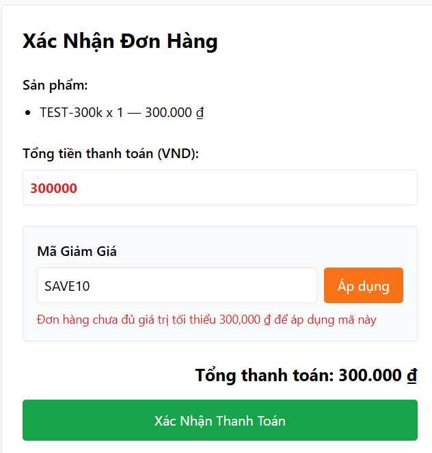
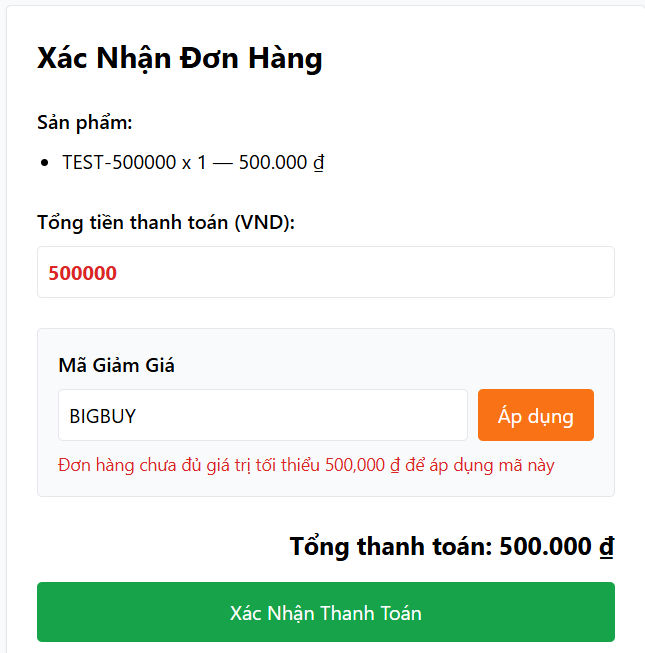

### B007 — Công thức percent sai (tiết kiệm âm, thành tiền tăng gấp 10 lần)
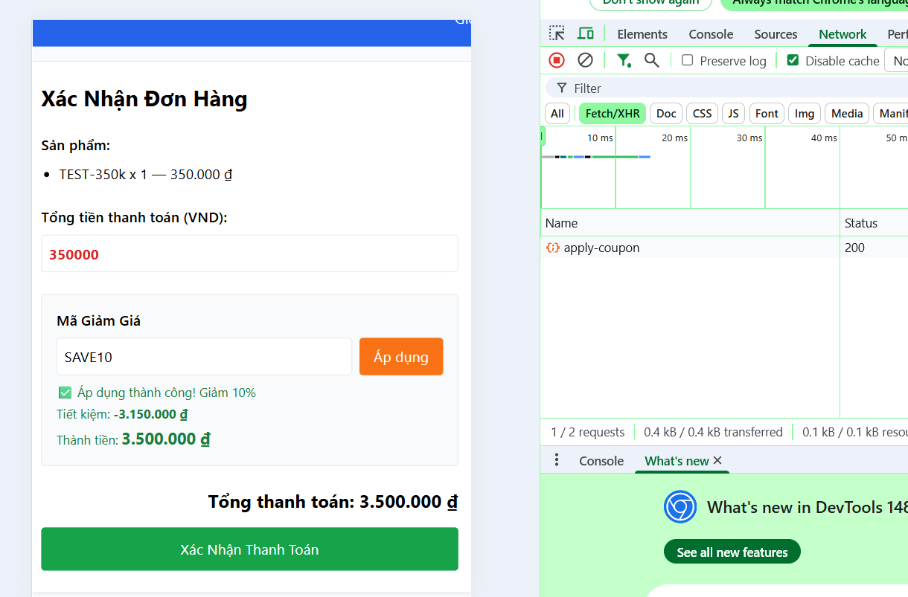

### B008 — Khách chưa đăng nhập vẫn áp mã thành công
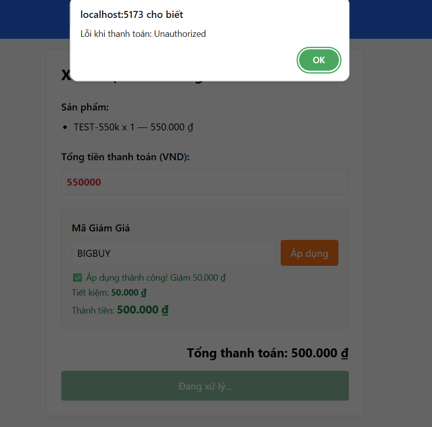

### B013 — Ô tổng tiền chỉnh sửa tự do, cộng hưởng với B007 tạo đơn hàng giả 350.000.000 ₫
**Lúc áp coupon (đã sửa tổng tiền thành 35.000.000):**
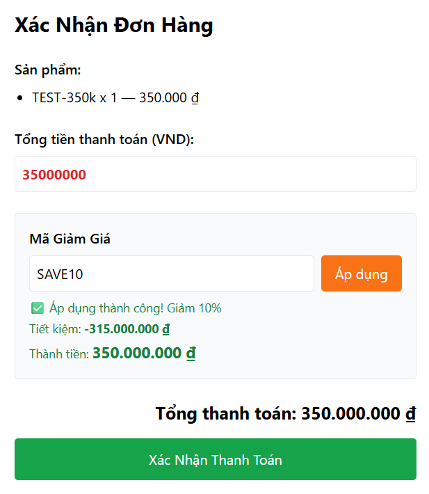

**Đơn hàng thật lưu trong Lịch sử đơn hàng:**
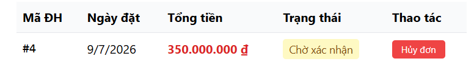

---

## Ảnh minh chứng — FR-15

### B009 — Backend không validate giá (chấp nhận 0, âm, rỗng)
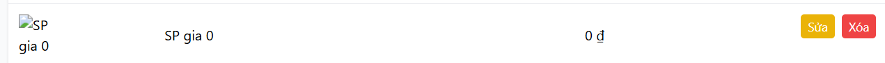
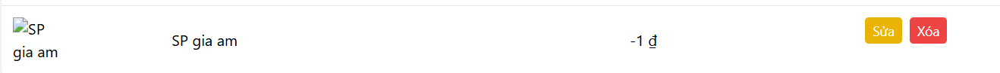
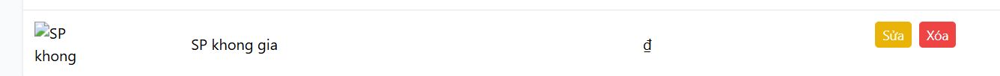

### B010 — Chấp nhận tên chỉ gồm khoảng trắng
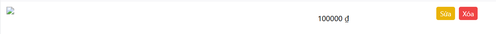

### B017 — Sửa 1 sản phẩm làm hiển thị sai toàn bộ danh sách cho đến khi tải lại trang
**Trước khi sửa:**
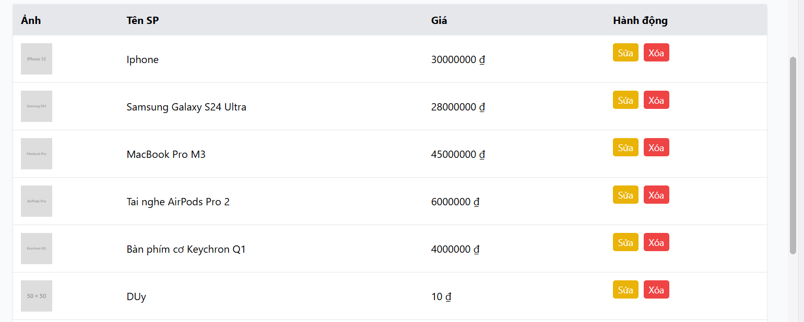

**Form đang sửa (giá trị mới):**
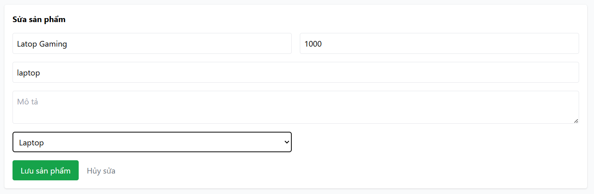

**Ngay sau khi lưu — toàn bộ sản phẩm bị đổi tên, dữ liệu sản phẩm sửa vẫn cũ:**
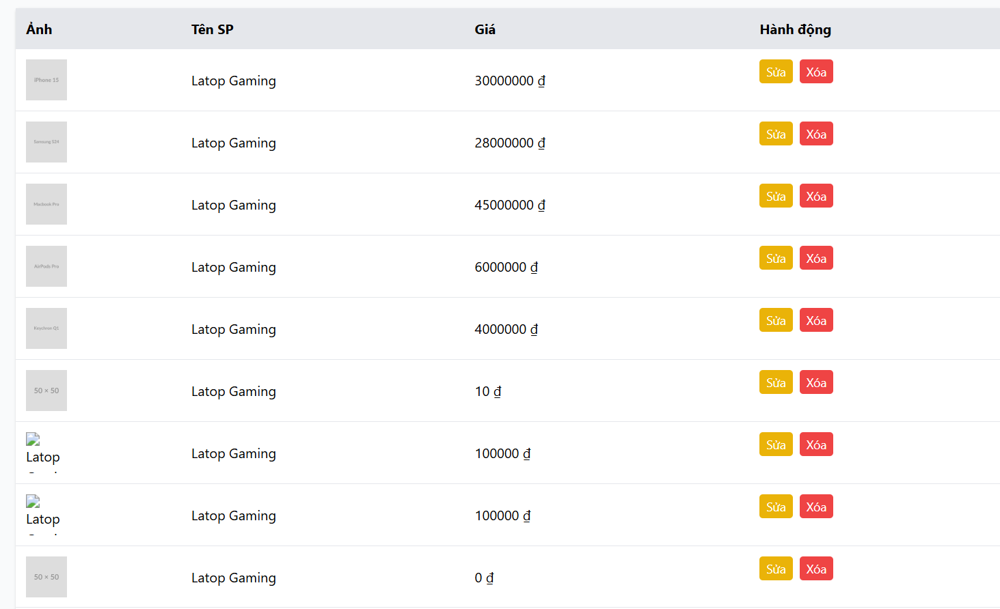

**Sau khi F5 — trở lại đúng:**
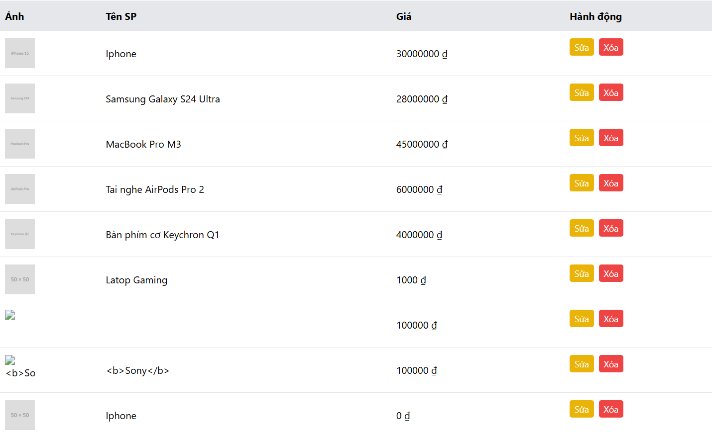

### B018 — Không giới hạn tên sản phẩm ở 255 ký tự
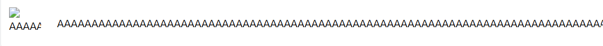

---

## Ghi chú phạm vi (lỗi ngoài phạm vi UI — KHÔNG tính là bug nộp)

Theo phạm vi Functional UI, các lỗi sau chỉ chạm được bằng gọi API trực tiếp nên **không đưa vào bảng bug**, chỉ ghi nhận ở AI Gap Analysis:

- FR-15: `POST/PUT/DELETE /api/products` thiếu kiểm tra token/role (broken access control) — admin UI đã chặn user thường đăng nhập nên không tái hiện được từ giao diện.
- Mật khẩu lưu plaintext; backend không validate khi gọi API trực tiếp.
