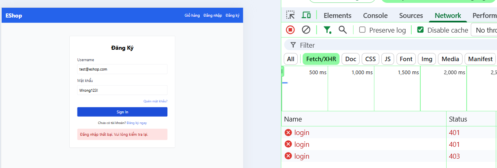
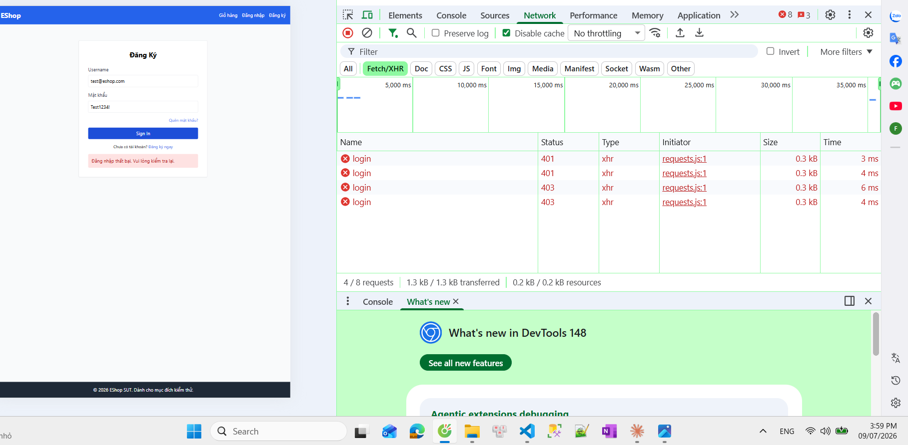
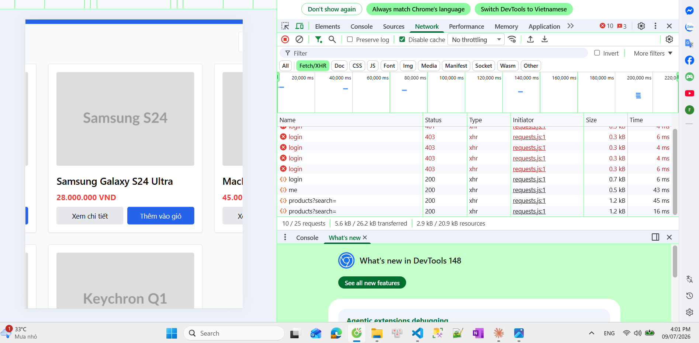
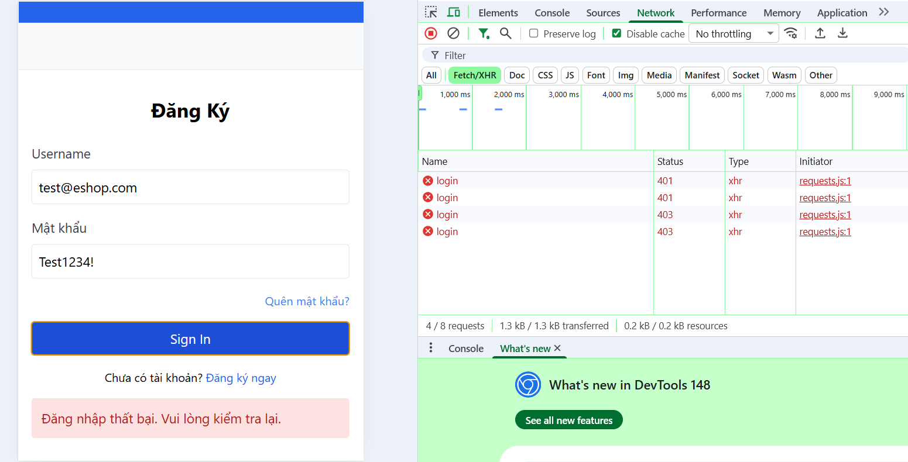
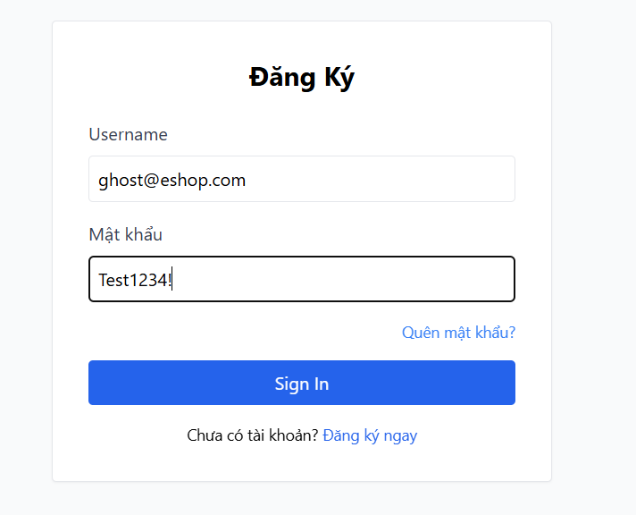
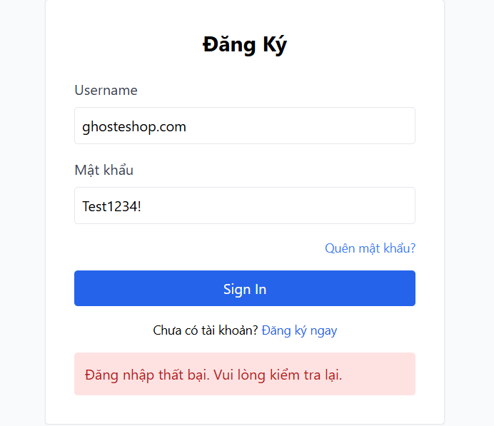
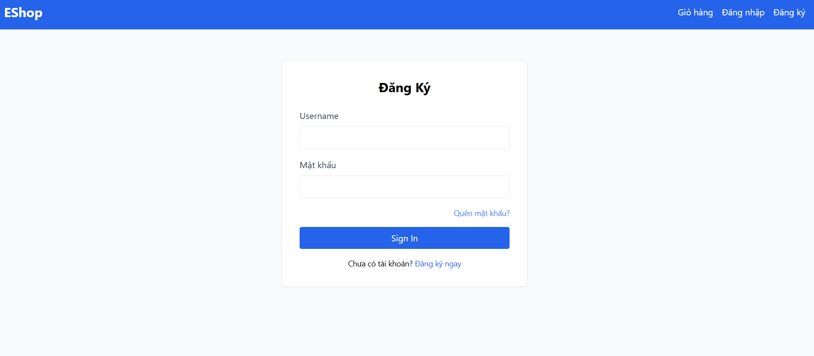

# Bug Report — HW02 Domain Testing on EShop

**Họ và tên:** [HỌ TÊN] · **MSSV:** [MSSV] · **Nhóm:** [Nhóm]
**Repo GitHub Issues (chứa screenshot):** https://github.com/DuyPham111/HW02/issues
**Môi trường chung:** Windows 11, Chrome [phiên bản], Node v22, backend :3000, web :5173, admin :5174, mobile Expo Go.

> **Cách dùng:** mỗi lỗi = 1 dòng trong bảng dưới + 1 ảnh trong `reports/FR-XX_bugs/BUG-00N.png`.
> Tạo GitHub Issue: Title = cột "Defect Title", body = copy cột "Description", **kéo-thả ảnh trực tiếp
> vào issue** (GitHub tự sinh URL — tránh ảnh không render), rồi điền link issue vào cột "GitHub Issue".
> Severity: Critical (mất tiền/bảo mật/hỏng dữ liệu) > High > Medium > Low (hiển thị/UX).

---

## Bảng tổng hợp lỗi (Defect List)

| Defect ID | Defect Title | Description (Pre-conditions / Steps / Expected / Actual) | Feature | Severity | Screenshot | GitHub Issue | Status |
| :---: | :--- | :--- | :---: | :---: | :--- | :--- | :---: |
| **B001** | [FR-02] Bộ đếm sai tăng nhanh hơn quy định, tài khoản khóa sớm hơn 1 lần | **Pre:** DB vừa reset, user `test@eshop.com`. **Steps:** 1. Mở /login, mở DevTools Network. 2. Nhập sai mật khẩu, bấm Sign In. 3. Lặp lại, quan sát status code từng lần. **Expected:** Spec ghi bộ đếm +1/lần và khóa từ lần sai thứ 3 — với cách backend kiểm tra khóa ở đầu mỗi request (dùng trạng thái đã lưu từ lần trước), điều này có nghĩa HTTP 403 chỉ nên xuất hiện từ **lần thứ 4** trở đi. **Actual:** Status đo được qua 3 lần thử liên tiếp: lần 1 = 401, lần 2 = 401, lần 3 = **403** (đã khóa) — sớm hơn 1 lần so với đúng thiết kế. Khớp với dòng code `login_attempts + 2` (`server.js:54`) thay vì `+ 1`. | FR-02 | `FR-02_bugs/B001.png` | [https://github.com/DuyPham111/HW02/issues/1] | Open |
| **B002** | [FR-02] Thời gian khóa thực tế ~3 phút thay vì 30 giây | **Pre:** Tài khoản đang bị khóa (HTTP 403 xác nhận). **Steps:** 1. Ghi giờ hiện tại. 2. Thử đăng nhập đúng ở các mốc: 30s, >1 phút, >2 phút, >3 phút — quan sát status code mỗi lần. **Expected:** Mở khóa (HTTP 200) sau **30 giây** (spec R2b). **Actual:** 30s → 403 (vẫn khóa); >1 phút → 403; >2 phút (3:59 PM → 4:01 PM) → 403; **sau hơn 3 phút → HTTP 200** (đăng nhập thành công, `me`/`products` tiếp theo đều 200). Khớp chính xác hằng số `Date.now() + 180000` (`server.js:57`). | FR-02 | `FR-02_bugs/B002-start.png`, `FR-02_bugs/B002-endafter3minutes.png` | [https://github.com/DuyPham111/HW02/issues/2] | Open |
| **B003** | [FR-02] UI không phân biệt "sai mật khẩu" và "tài khoản bị khóa" | **Pre:** Tài khoản đang bị khóa (đã xác nhận HTTP 403 ở 2 lần thử trước). **Steps:** 1. Nhập đúng `test@eshop.com` / `Test1234!`. 2. Bấm Sign In. 3. Đọc thông báo. 4. Xem status code trên DevTools Network. **Expected:** Thông báo cho biết tài khoản đang bị khóa (khác câu sai mật khẩu). **Actual:** DevTools xác nhận **HTTP 403** (đang khóa) dù mật khẩu đúng, nhưng UI vẫn hiển thị y hệt "Đăng nhập thất bại. Vui lòng kiểm tra lại." — không có gì phân biệt với trường hợp sai mật khẩu (401). | FR-02 | `FR-02_bugs/B003.png` | [https://github.com/DuyPham111/HW02/issues/3] | Open |
| **B004** | [FR-02] Ô mật khẩu hiển thị rõ ký tự (thiếu `type="password"`) | **Pre:** Ở trang /login. **Steps:** 1. Gõ ký tự vào ô mật khẩu. 2. Quan sát. **Expected:** Hiển thị dạng ẩn `•••` (FR-22). **Actual:** Ký tự hiển thị rõ dạng plaintext (vd `Test1234!`), không bị che. | FR-02 | `FR-02_bugs/B004.png` | [https://github.com/DuyPham111/HW02/issues/4] | Open |
| **B005** | [FR-02] Ô email dùng `type="text"`, không validate định dạng | **Pre:** Ở /login. **Steps:** 1. Nhập email sai định dạng (không có `@`, vd `ghosteshop.com`) và mật khẩu bất kỳ. 2. Bấm Sign In. **Expected:** Bị chặn định dạng email ngay tại form (spec R5, `type="email"`). **Actual:** Không có popup cảnh báo, request vẫn được gửi lên server; hệ thống hiển thị lỗi chung "Đăng nhập thất bại. Vui lòng kiểm tra lại." | FR-02 | `FR-02_bugs/B005.png` | [https://github.com/DuyPham111/HW02/issues/5] | Open |
| **B012** | [FR-02] Trang Đăng nhập hiển thị tiêu đề và nhãn sai ngôn ngữ/ý nghĩa | **Pre:** Ở trang /login. **Steps:** 1. Mở trang /login. 2. Quan sát tiêu đề, nhãn các ô nhập, nhãn nút submit. **Expected:** Tiêu đề "Đăng Nhập"; nhãn "Email"; nút "Đăng Nhập" (tiếng Việt, đúng FR-21 nhất quán ngôn ngữ). **Actual:** Tiêu đề hiển thị "Đăng Ký" (sai — đây là trang Đăng Nhập); nhãn ghi "Username" (tiếng Anh) thay vì "Email"; nút ghi "Sign In" (tiếng Anh) thay vì "Đăng Nhập". | FR-02 | `FR-02_bugs/B012.png` | [https://github.com/DuyPham111/HW02/issues/6] | Open |
| **B006** | [FR-09] Đơn đúng bằng ngưỡng tối thiểu bị từ chối (off-by-one `>`) | **Pre:** User đăng nhập, giỏ = đúng 300.000. **Steps:** 1. Vào Checkout. 2. Nhập `SAVE10`, Áp dụng. **Expected:** Chấp nhận, giảm 30.000, còn 270.000 (spec C3 `>=`). **Actual:** [điền — dự đoán: báo chưa đủ ngưỡng] | FR-09 | `FR-09_bugs/B006.png` | [link] | Open |
| **B007** | [FR-09] Công thức percent sai, tiền giảm âm / thành tiền tăng gấp 10 lần | **Pre:** User đăng nhập, giỏ = 350.000 (sản phẩm `TEST-350k`). **Steps:** 1. Vào Checkout. 2. Nhập `SAVE10`, Áp dụng. **Expected:** Giảm 35.000 (10%), còn 315.000 (spec: `discount = total × value / 100`). **Actual:** Hệ thống hiện "Tiết kiệm: **-3.150.000 ₫**" (âm), "Thành tiền: **3.500.000 ₫**" (gấp 10 lần đơn gốc). Khớp chính xác công thức sai trong code `Math.floor(total_amount * (1 - coupon.discount_value))` (`server.js:399-401`) — với `discount_value=10` (10, không phải 0.1), phép tính trở thành `total*(1-10) = -9*total`. | FR-09 | `FR-09_bugs/B007.png` | [link] | Open |
| **B008** | [FR-09] Khách chưa đăng nhập vẫn áp được mã (thiếu kiểm tra C4) | **Pre:** Đã đăng xuất. **Steps:** 1. Vào Checkout với giỏ ≥ 300.000. 2. Nhập `SAVE10`, Áp dụng. **Expected:** Từ chối, yêu cầu đăng nhập (spec C4). **Actual:** [điền] | FR-09 | `FR-09_bugs/B008.png` | [link] | Open |
| **B009** | [FR-15] Chấp nhận giá = 0 / giá âm (thiếu validate price > 0) | **Pre:** Đăng nhập admin, tab Sản phẩm. **Steps:** 1. Thêm sản phẩm, name hợp lệ, price=`0` (rồi `-1`). 2. Lưu. **Expected:** Từ chối (spec R2 giá > 0). **Actual:** [điền — dự đoán: lưu thành công] | FR-15 | `FR-15_bugs/B009.png` | [link] | Open |
| **B010** | [FR-15] Chấp nhận tên chỉ gồm khoảng trắng | **Pre:** Đăng nhập admin, tab Sản phẩm. **Steps:** 1. Thêm sản phẩm, name=`"   "`, price hợp lệ. 2. Lưu. **Expected:** Từ chối (tên bắt buộc, R1). **Actual:** [điền] | FR-15 | `FR-15_bugs/B010.png` | [link] | Open |
| **B011** | [FR-02 Mobile] App không phân biệt sai mật khẩu vs bị khóa | **Pre:** Chạy app Expo, tài khoản đang bị khóa. **Steps:** 1. Thử đăng nhập trên app. 2. Đọc thông báo. 3. Đối chiếu 403 backend. **Expected:** App cho biết đang bị khóa. **Actual:** [điền — dự đoán: cùng câu chung như sai mật khẩu] | FR-02 Mobile | `FR-02-mobile_bugs/B011.png` | [link] | Open |
| **B013** | [FR-09] Ô "Tổng tiền thanh toán" cho phép chỉnh sửa tự do, gửi thẳng giá trị giả lên server (kể cả sau khi áp coupon) | **Pre:** Đăng nhập, giỏ = 350.000 (`TEST-350k`). **Steps:** 1. Vào Checkout. 2. Sửa ô "Tổng tiền thanh toán" từ `350000` thành `1000`. 3. Bấm "Xác Nhận Thanh Toán". 4. Vào Lịch sử đơn hàng, kiểm tra `Tổng tiền` của đơn vừa tạo. **Expected:** Ô phải chỉ đọc; backend phải tự tính lại tổng tiền từ giỏ hàng, không nhận `total_amount` client gửi lên. **Actual:** Ô nhập tự do (`<input type="number">` không `readOnly`, `Checkout.jsx:93-102`) — giá trị này chính là `total_amount` được gửi cho cả `/api/apply-coupon` (`Checkout.jsx:30`) lẫn `/api/checkout` (`Checkout.jsx:47`). **Đã xác nhận bằng đơn hàng thật:** đơn `#3` trong Lịch sử đơn hàng lưu **Tổng tiền = 1.000 ₫** (đúng bằng giá trị đã sửa tay), không phải 350.000 ₫ thật của giỏ hàng — xác nhận backend hoàn toàn tin tưởng giá trị client gửi, không tự tính lại. | FR-09 | `FR-09_bugs/B013.png` | [link] | Open |

> **Thêm dòng khi phát hiện lỗi mới.** Chỉ đưa vào bảng những lỗi bạn **đã tự chạy và chụp được ảnh**.
> Nếu một TC dự đoán ở trên chạy ra KHÔNG phải bug (khác dự đoán) → xóa dòng đó, đừng báo bug sai.

---

## Ảnh minh chứng — FR-02

### B001 — Khóa xuất hiện sớm hơn 1 lần (401 → 401 → 403)

### B002 — Thời gian khóa thực tế ~3 phút
**Lúc bắt đầu khóa:**

**Sau hơn 3 phút, đã mở khóa:**

### B003 — Mật khẩu đúng vẫn bị từ chối (403) khi đang khóa, thông báo không phân biệt

### B004 — Ô mật khẩu hiển thị rõ ký tự

### B005 — Email sai định dạng không bị chặn

### B012 — Tiêu đề/nhãn trang Đăng nhập sai ngôn ngữ

---

## Ghi chú phạm vi (lỗi ngoài phạm vi UI — KHÔNG tính là bug nộp)

Theo phạm vi Functional UI, các lỗi sau chỉ chạm được bằng gọi API trực tiếp nên **không đưa vào bảng bug**, chỉ ghi nhận ở AI Gap Analysis:

- FR-15: `POST/PUT/DELETE /api/products` thiếu kiểm tra token/role (broken access control) — admin UI đã chặn user thường đăng nhập nên không tái hiện được từ giao diện.
- Mật khẩu lưu plaintext; backend không validate khi gọi API trực tiếp.
